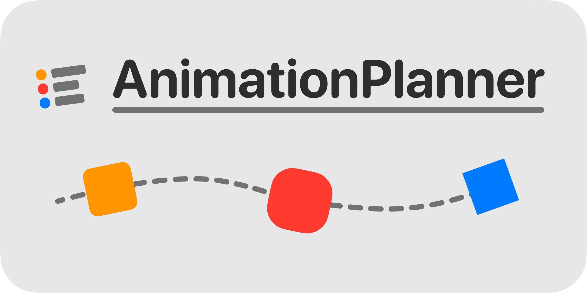

[](https://swiftpackageindex.com/PimCoumans/AnimationPlanner)
 [](https://swiftpackageindex.com/PimCoumans/AnimationPlanner)


 
# AnimationPlanner

⛓ Chain multiple `UIView` animations without endless closure nesting. Clear, consize syntax on the same indentation level with a convenient result builders API.

🆗 AnimationBuilder is used in all exuberant animations seen in the [OK Video](https://okvideo.app/download) app.

📖 Check out the [documentation](https://swiftpackageindex.com/PimCoumans/AnimationPlanner/main/documentation/animationplanner) to get up to speed, or read on to see a little example.

## How do I plan my animations?

📦 Add `AnimationPlanner` to your project (using Swift Package manager) and start typing `AnimationPlanner.plan` to embark on your animation journey. Like what‘s happening in the code below.

```swift
AnimationPlanner.plan {
    Wait(0.35)
    Animate(duration: 0.32, timingFunction: .quintOut) {
        view.alpha = 1
        view.center.y = self.view.bounds.midY
    }
    Wait(0.2)
    Animate(duration: 0.32) {
        view.transform = CGAffineTransform(scaleX: 2, y: 2)
        view.layer.cornerRadius = 40
        view.backgroundColor = .systemRed
    }.timingFunction(.quintOut)
    Wait(0.2)
    AnimateSpring(duration: 0.25, damping: 0.52) {
        view.backgroundColor = .systemBlue
        view.layer.cornerRadius = 0
        view.transform = .identity
    }
    Wait(0.58)
    Animate(duration: 0.2) {
        view.alpha = 0
        view.transform = .identity
        view.frame.origin.y = self.view.bounds.maxY
    }.timingFunction(.circIn)
} completion: { finished in
    view.removeFromSuperview()
}
```

The above code results in the following animation. For more examples see the [Sample App](Sample%20App/AnimationPlanner-Sample/ViewController.swift) available when cloning the repo.
<p align="center">
    
</p>

_**Note:** The example shows usage of custom extension methods on `CAMediaTimingFunction` available in the framework_

## Installation

### 🛠 Adding AnimationPlanner as a package dependency

1. Go to `File` -> `Add Packages`
3. Paste `https://github.com/PimCoumans/AnimationPlanner` in the search bar and click on "Add Package"
4. Select the target(s) in which you want to use AnimationPlanner

### 📦 Swift Package Manager

Manually add AnimationPlanner as a package dependency in `package.swift`, by updating your package definition with: 

```swift
  dependencies: [
    .package(name: "AnimationPlanner", url: "https://github.com/PimCoumans/AnimationPlanner.git", .branch("main"))
  ],
```

And updating your target‘s dependencies property with `dependencies: ["AnimationPlanner"]`

## 🔮 Future plans
 
While this API removes a lot of unwanted nesting in completion closures when using traditional `UIView.animate...` calls, a project is never finished and for future versions I have the following plans:
 - Cancel running animation sequences. Current idea is returning a `RunningAnimation` object with a `cancel()` method and information about the state of the animation sequence.
 - Remove usage of inaccurate `DispatchQueue.main.asyncAfter` for manually adding delays where needed.
 - Tidy the API even more by using Swift‘s builder pattern, like we see used in SwiftUI. In practice this would mean removing one more indent in your code! (Currently work in progress: see [Result builders](https://github.com/PimCoumans/AnimationPlanner/pull/10) to see what‘s going on)
 - Maybe even allow this package to be used with SwiftUI? No idea how that would work.
 
Got any feedback or suggestions? Please let me know! ✌🏻

→ [twitter.com/pimcoumans](https://twitter.com/pimcoumans)
