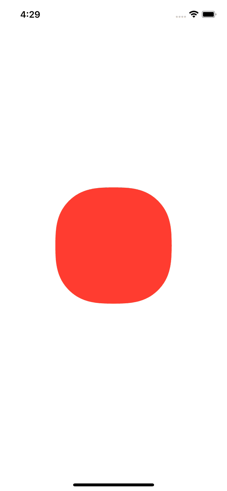

# AnimationPlanner

Chain multiple `UIView` animations without endlessly nesting in completion closures.
Very useful with @warpling‘s [`CAMediaTimingFunction` extensions ](https://gist.github.com/warpling/21bef9059e47f5aad2f2955d48fd7c0c), giving you all the curves.

```swift
UIView.animateSteps { sequence in
    sequence
        .delay(0.35)
        .add(duration: 0.5, timingFunction: .quartOut) {
            view.alpha = 1
            view.center.y = self.view.bounds.midY
        }
        .delay(0.2)
        .add(duration: 0.32, timingFunction: .quintOut) {
            view.transform = CGAffineTransform(scaleX: 2, y: 2)
            view.layer.cornerRadius = 40
            view.backgroundColor = .systemRed
        }
        .delay(0.2)
        .add(duration: 0.12, timingFunction: .backOut) {
            view.backgroundColor = .systemBlue
            view.layer.cornerRadius = 0
            view.transform = .identity
        }
        .delay(0.58)
        .add(duration: 0.2, timingFunction: .circIn) {
            view.alpha = 0
            view.transform = .identity
            view.frame.origin.y = self.view.bounds.maxY
        }
} completion: { finished in
    view.removeFromSuperview()
}
```

The above code creates the following animation

<p align="center">
    
</p>
