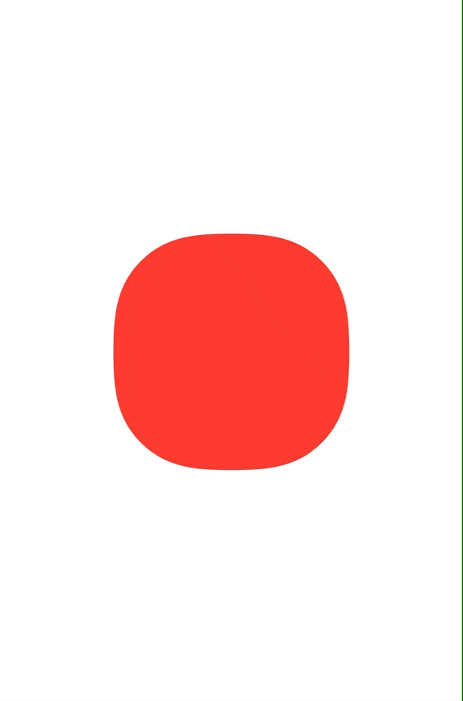

[](https://swiftpackageindex.com/PimCoumans/AnimationPlanner)
 [](https://swiftpackageindex.com/PimCoumans/AnimationPlanner)
 
 
# AnimationPlanner

Chain multiple `UIView` animations without endlessly nesting in completion closures. Used in some of the more superfluous animations in the [OK Video](https://okvideo.app/download) app.
Very useful with @warpling‘s [`CAMediaTimingFunction` extensions](https://gist.github.com/warpling/21bef9059e47f5aad2f2955d48fd7c0c), giving you all the animation curves you need.

Read the [documentation](https://swiftpackageindex.com/PimCoumans/AnimationPlanner/main/documentation/animationplanner) to get you up to speed, or read on on to see a little example.

## How do I do this?
Add `AnimationPlanner` to your project (only SPM is currently officially supported) and use the `UIView.animateSteps()` method to start adding steps to the provided sequence, like shown below.

```swift
UIView.animateSteps { sequence in
    sequence
        .delay(0.35)
        .add(duration: 0.5, timingFunction: .quartOut) {
            view.alpha = 1
            view.center.y = self.view.bounds.midY
        }
        .delay(0.2)
        .add(duration: 0.32, timingFunction: .quintOut) {
            view.transform = CGAffineTransform(scaleX: 2, y: 2)
            view.layer.cornerRadius = 40
            view.backgroundColor = .systemRed
        }
        .delay(0.2)
        .add(duration: 0.12, timingFunction: .backOut) {
            view.backgroundColor = .systemBlue
            view.layer.cornerRadius = 0
            view.transform = .identity
        }
        .delay(0.58)
        .add(duration: 0.2, timingFunction: .circIn) {
            view.alpha = 0
            view.transform = .identity
            view.frame.origin.y = self.view.bounds.maxY
        }
} completion: { finished in
    view.removeFromSuperview()
}
```

The above code creates the following animation. For more examples see the Sample App available when cloning the repo.
<p align="center">
    
</p>

(The example shows the custom extension methods for `CAMediaTimingFunction` mentioned in the intro)

## Installation

### Adding AnimationPlanner as a package dependency

1. Go to `File` -> `Add Packages`
3. Paste `https://github.com/PimCoumans/AnimationPlanner` in the search bar and click on "Add Package"
4. Select the target(s) in which you want to use AnimationPlanner

### 📦 Swift Package Manager

Manually add AnimationPlanner as a package dependency in `package.swift`, by updating your package definition with: 

```swift
  dependencies: [
    .package(name: "AnimationPlanner", url: "https://github.com/PimCoumans/AnimationPlanner.git", .branch("main"))
  ],
```

And updating your target‘s dependencies property with `dependencies: ["AnimationPlanner"]`

## Future plans
 
While this API removes a lot of unwanted nesting in completion closures when using traditional `UIView.animate...` calls, a project is never finished and for future versions I have the following plans:
 - Add support for the spring-based animations
 - Tidy the API even more by using Swift‘s builder pattern, like we see used in SwiftUI. In practice this would mean removing one more indent in your code!
 - Maybe even allow this package to be used with SwiftUI? No idea how that would work.
 
Got any feedback or suggestions? Please let me know! ✌🏻

→ [twitter.com/pimcoumans](https://twitter.com/pimcoumans)
